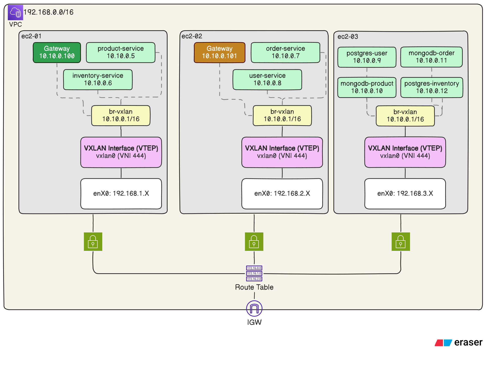
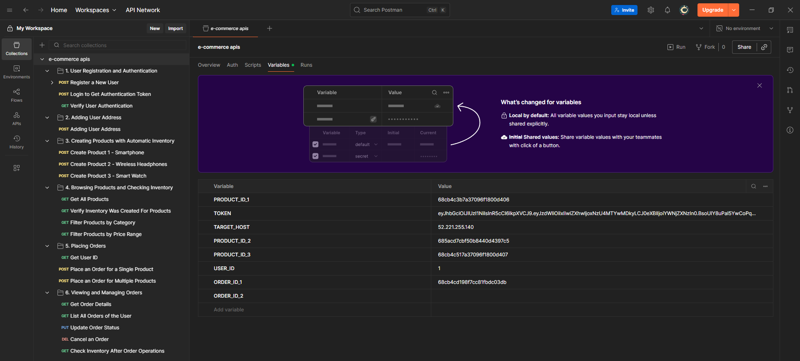
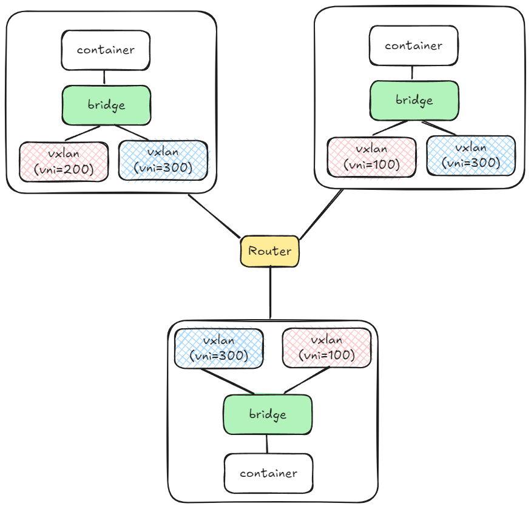
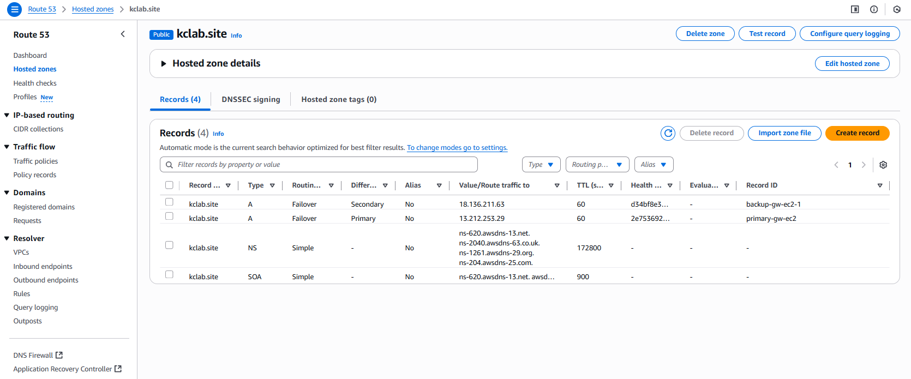

## Project Overview

The goal of this project is to,

1. Provision 3 EC2 instance with separate subnets inside a custom VPC.
2. Configure 3 EC2 instance with VxLAN so that containers running inside these EC2s can communicate with each other with VxLAN overlay.
3. Deploy E-commerce microservice containers across the EC2 instances.

The total deployment is automated through Pulumi (Python), Bash and Makefile.

## Architecture

LLD of the infrastructure:



In this architecture, 3 microservice running on first EC2, 3 microservices running on second EC2 and 4 microservices are running on third EC2.

API GW is in Active-Active state in first and second EC2. All the database, with its storage volume is in the third EC2.

All microservices are communicating with each other using docker bridge network IP. This is being possible through VXLAN interface.

**Note:** I've used [poridhioss/E-commerce-Microservices](https://github.com/poridhioss/E-commerce-Microservices) project to deploy in this infrastructure.

## Prerequisites

Before running the project, ensure you have:

- **AWS Account** with proper permissions and balance.
- **Pulumi CLI** installed.
- **AWS CLI** installed and configured with access and secret token.
- **Postman** installed.
- **Make** uitlity instaled

## Deployment & Execution

> ⚠️ **Attention**: Make sure you have all the prerequisites mentioned previously before proceeding for deployment.

To deploy the infrastructure and services you just need to run 2 commands.

1. **Use The Template**. Yes, this repo is actually a Pulumi template. You can directly setup you project just running the following command in an **empty directory**.

   ```
   pulumi new https://github.com/kcnaiamh/distributed-microservices-using-vxlan-pulumi-bash-aws
   ```

   For any question prompt, you can just press enter to select the default.

2. **Built It**. To build the infrastructure, I've written a Makefile to run all the manual commands automatically.

   ```
   make build
   ```

   It will take 6-7 minutes for provisioning and configuring the infrastructure.

   If you want to get into the first EC2, just run `ssh host1` in your terminal. Similarly, `ssh host2` and `ssh host3` respectively.

3. **Import Postman**. Import `e-commerce apis.postman_collection.json` file into postman to interact with the e-commerce site.

   Make sure you update `TARGET_HOST` variable with one of the gateway (public) IPs.

   

   You can get the public and private IPs of EC2 instances by running the following command:

   ```
   pulumi stack output
   ```

4. 🚨 **Do the Cleanup**. Run `make cleanup` to delete the whole infrastructure. (Be cautious about AWS bill.)

## Challenges and Solutions

While doing the project, I encountered several challenges. In this section, I'll highlight the most significant ones and how I resolved them.

1. [Implementing with 3 different VNIs — Disaster](https://github.com/kcnaiamh/distributed-microservices-using-vxlan-pulumi-bash-aws?tab=readme-ov-file#1-implementing-with-3-different-vnis--disaster)
2. [Using VRRP protocol with keepalived for single GW IP](https://github.com/kcnaiamh/distributed-microservices-using-vxlan-pulumi-bash-aws?tab=readme-ov-file#2-using-vrrp-protocol-with-keepalived-for-single-gw-ip)
3. [Multiple docker-compose file, but same network!](https://github.com/kcnaiamh/distributed-microservices-using-vxlan-pulumi-bash-aws?tab=readme-ov-file#3-multiple-docker-compose-file-but-same-network)
4. [SSH keypair gets deleted when I do pulumi up -y again!](https://github.com/kcnaiamh/distributed-microservices-using-vxlan-pulumi-bash-aws?tab=readme-ov-file#4-ssh-keypair-gets-deleted-when-i-do-pulumi-up--y-again)
5. [SSH Multiplexing – breaking docker commands!](https://github.com/kcnaiamh/distributed-microservices-using-vxlan-pulumi-bash-aws?tab=readme-ov-file#5-ssh-multiplexing--breaking-docker-commands)

### 1. Implementing with 3 different VNIs — Disaster

My first architecture was, each EC2 will communicate with other two EC2 using different VTEP (VXLAN interface).

Experimenting with two EC2 was giving promising results. But when I added one more EC2, I needed to add two more VTEP – and here the chaos started.

I couldn't figure out where the problem was at first.
Most of the ICMP (Ping) packet dropping.
TCP handshake response dropping.

Then I start digging the issue layer by layer.

First I disabled the UFW firewall, but the issue still persisted.

Then I've checked inside container and the host that if ARP table is populating using `arp -n` command. — Working.

After that I checked the route table with `route -n`— Routing path is properly defined.

Lastly, I used tcpdump to monitor traffic inside container namespace and root namespace all interface with different filters. — the result was shocking!

Linux bridge is flooding all the traffic to all the interfaces. Both VXLAN is encapsulating the traffic and sending it to different destination host. The destination hosts response packets are also broadcasted by their bridge. And this lead to flood of packets.

This increases the CPU usage and most of the packets are started to dropping and EC2 becomes slow (As I was using t2.micro type instance)

The real problem is having two interface under one bridge. Bridge broadcast the traffic in two different interface and this creates the packet flooding.



Then I changed the design to only use one VNI for all the EC2s.

### 2. Using VRRP protocol with keepalived for single GW IP

If successfully deploying the infra with VXLAN setup, I thought it would be cool to use VRRP with keepalived to use redundant nginx gateway in active-passive state.

While doing the setup, found that this will not work in AWS VPC.

Classic VRRP relies on broadcast/multicast advertisements to elect a master and backup.

But, AWS does not support multicast or broadcast in VPCs. You can not specify VRRP protocol (L2) in security group. This means VRRP advertisements won’t work in their raw form inside AWS.

So, I changed my plan to use Route53 for this.

I create a hosted zone with two A records with Failover routing policy. If the primary GW becomes unreachable (unhealth) then the domain name will fallback to secondary GW IP.



### 3. Multiple docker-compose file, but same network!

After successfully setting up the Active-Passive state of Gateway using Route53, now I got another challenge.

_How can I run three docker compose in different EC2 but yet the containers will run like they are connected under same bridge?_

Already I have VXLAN setup. I just need to figure out:

1. How to use existing bridge using compose file.
2. How to resolve container name to IP address in three different EC2s
3. How to manage dependent containers across EC2s.

To solve the first challenge, I use the following directive in all the compose file:

```yaml
networks:
  br-vxlan:
    external: true
```

This tells docker compose to use existing `br-vxlan` network (bridge), without creating one.
All `br-vxlan` bridge across EC2s have have same configuration. This way, containers will be in same pre-specified network.

Now, for the second challenge, I specified IP address for all the containers in compose file.

```yaml
networks:
  br-vxlan:
    ipv4_address: 10.10.0.5 # IP will be unique for each container
```

As the IPs are pre-specified so I can use `/etc/hosts` to map container name and IP address in all the EC2s. This way, each container can call other containers by name, not IP address. And this solves the third challenge.

### 4. SSH keypair gets deleted when I do `pulumi up -y` again!

Previously, I was using the following logic for SSH key-pair creation:

1. Check if key exist using `aws.ec2.get_key_pair(key_name=key_name)`.
2. If found, return `None`. If exception, go to exception block.
3. In exception block -- create keypair and store private key in `~/.ssh/{key_name}.id_rsa` file.
4. Return the created keypair object.

The logic seem accurate. But the problem was I didn't know how pulumi works internally.

When you run `pulumi up -y`, pulumi builds a resource graph form resource declaration using pulumi engine. The `aws.ec2.get_key_pair()` calls data-source and returns the value. Its not part of resource declaration. So, when try block returns with `None`, the resource graph doesn't contain the key creation resource declaration. So the desire states differs from the current state. And pulumi destroy the key-pair it previously created.

So the flow is:

- First run (key missing): Pulumi executes except → creates a new KeyPair → **added to state**.
- Next run (`get_key_pair` succeeds): Returns `None` → KeyPair resource not declared → Pulumi sees _“this KeyPair is in state but not in code”_ → **Pulumi destroys it**.

This creates a flapping behavior; create on one run, destroy on the next.

To solve this, I used a boolean variable named `create_key`. At first the variable will be `true`. It will allow to call the `create_ssh_key` function. After first run, the variable will be set to `false`. Also, try-except logic is removed.

### 5. SSH Multiplexing – breaking docker commands!

In `Makefile`, I've used SSH a lot (21 times). Every time, new SSH connection is created. To make the process efficient I planned to do SSH multiplexing. This way I will create one master connection and reuse it again.

I'd used the following directives in `~/.ssh/config` file.

```
ControlMaster auto
ControlPath ~/.ssh/master-%r@%h:%p
ControlPersist 10m
```

But using single connection became itself a problem.

When I'm creating the first master connection, the `ubuntu` user is not in `docker` group.
After adding the user in `docker` group I need to create a new connection. Otherwise I need to use `sudo` for every docker commands to communicate with socket.

So I've two options, refactor the code again, or just remove the multiplexing part.

I remove the multiplexing part because:

1. Windows openssh binary doesn't support ssh multiplexing.
2. I don't want to modify just to run in \*nix based system.

## Setup Without Pulumi Template

If you want to clone the git repo and want to configure it manually, then follow this instruction:

1. Clone the git repo.
   ```
   git clone git@github.com:kcnaiamh/distributed-microservices-using-vxlan-pulumi-bash-aws.git
   ```
2. Remove `.example` from `Pulumi.dev.yaml.example` file name.

3. Setup python virtual environment. (assuming linux environment)
   ```
   python3 -m venv venv
   source ./venv/bin/activate
   pip install -r requirements.txt
   ```
4. Provide AWS configuration and credential.
   ```
   aws configure
   ```
5. Create a stack name `dev`. If you use other name then create `Pulumi.<your-stack-name>.yaml` file accordingly
   ```
   pulumi stack init dev
   ```
6. Dry run the code
   ```
   pulumi preview
   ```
7. Deploy it
   ```
   make build
   ```
